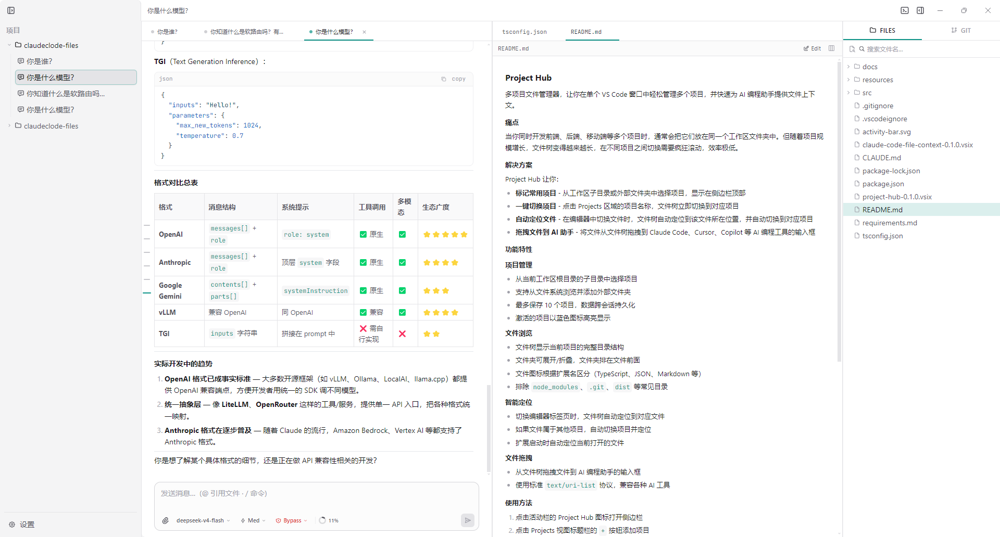
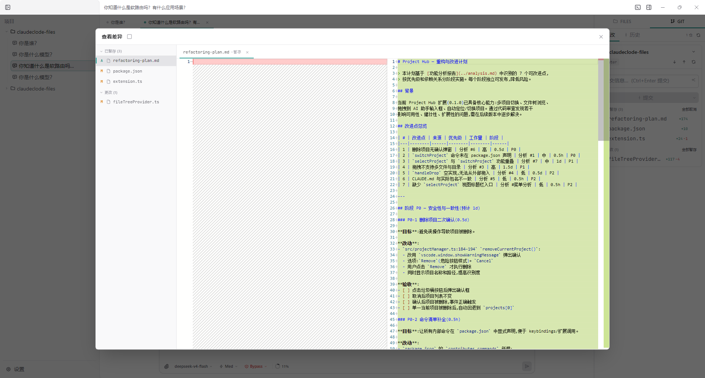
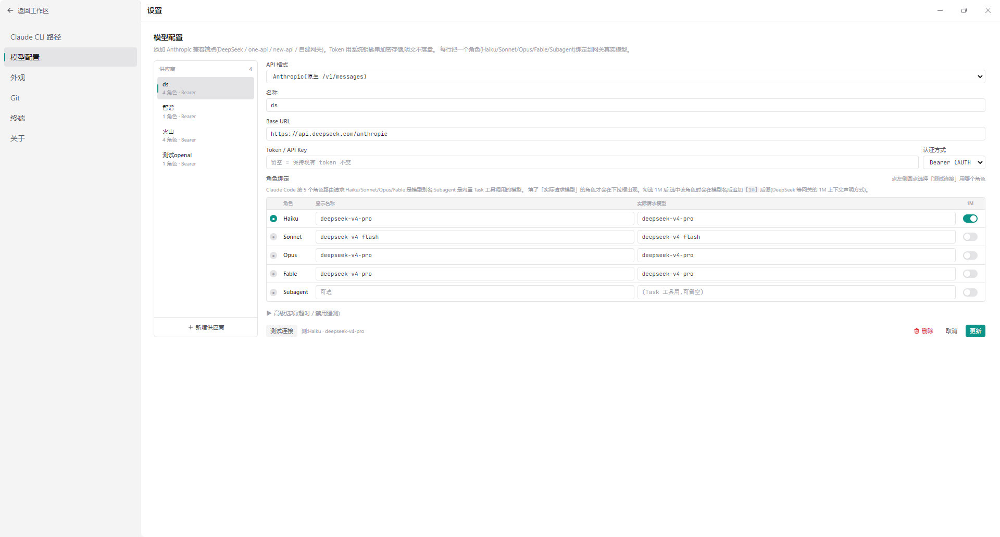
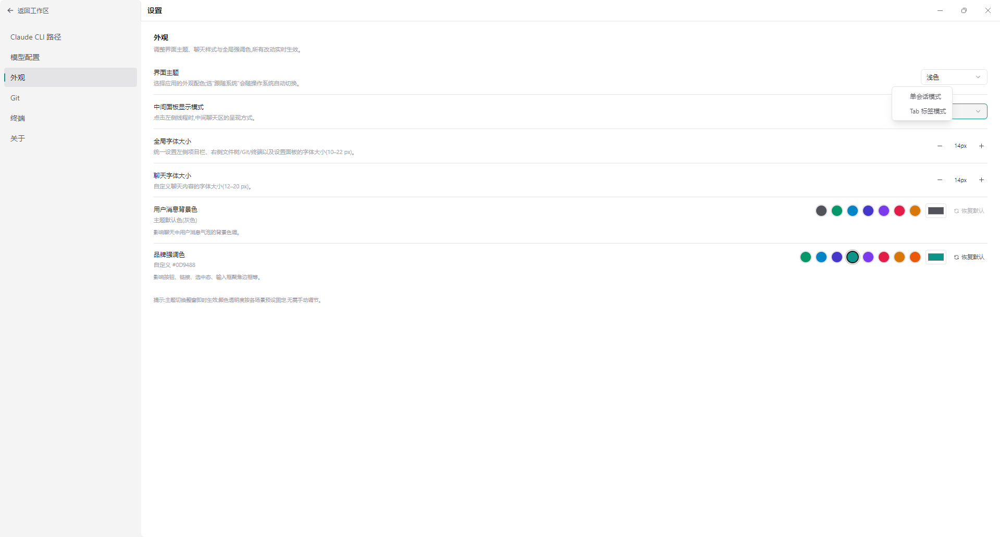
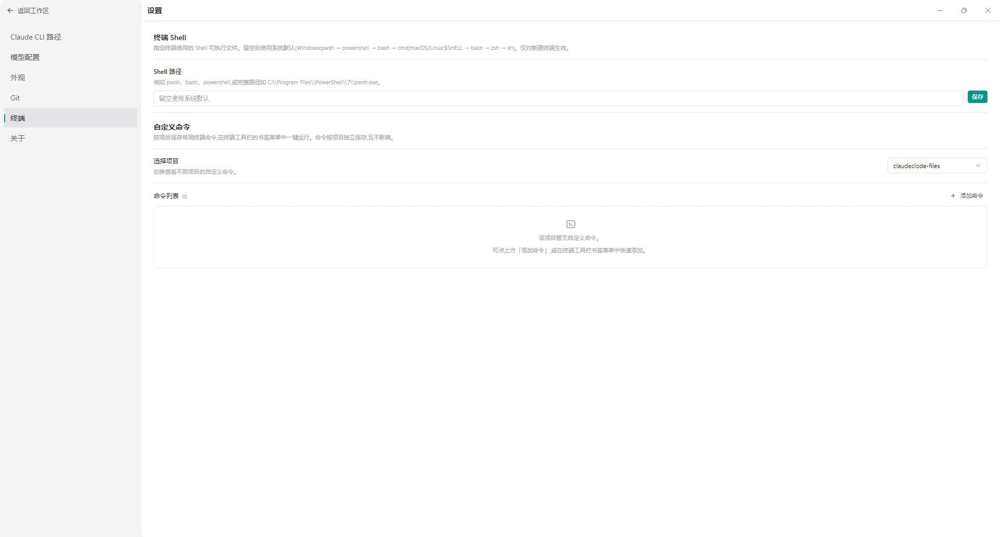
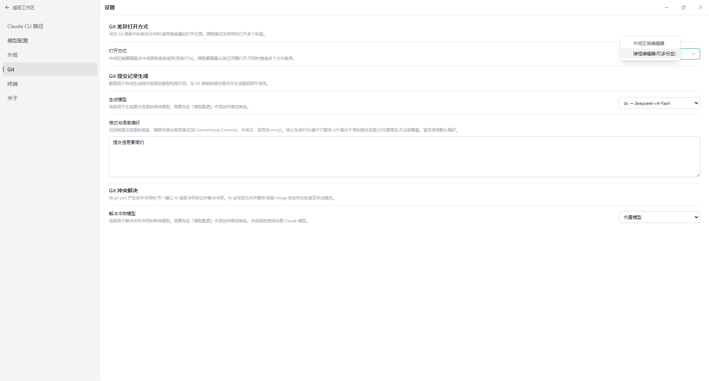

# Mcode

**English** | [中文](#中文)

---

## English

**Mcode** - *my* Code. A desktop GUI for coding agents - a three-pane IDE built on top of agent SDKs ([Claude Agent SDK](https://code.claude.com/docs/en/agent-sdk) and [Pi Coding Agent](https://pi.dev/)). It does **not** reimplement the agent; it provides the interaction surface: session management, real-time streaming, tool approvals, and IDE affordances (files, git, terminal).



### Features

#### 🤖 Multi-provider agents
- Built-in **Claude** provider (via `@anthropic-ai/claude-agent-sdk`) and **Pi** provider (via `@earendil-works/pi-coding-agent`) — pick one in the composer before the first message of a session.
- Each provider declares its own capabilities, and the UI adapts automatically: thinking levels, permission modes, built-in models, custom endpoint support.
- Pi: 8 thinking levels, tools allowlist instead of permission modes, model discovery from `~/.pi/agent/models.json` (maintained through **Settings → Pi Models**), no tool approvals yet.

#### 💬 Real-time conversation
- Drives the agent loop through the chosen provider SDK; messages stream in live, token by token.
- Assistant messages, tool calls, and tool results are rendered as structured cards.
- Tool-use approvals: allow / allow-once / deny, with a per-session pending queue.
- Attach files, paste images, and use slash commands from the composer.

#### 🗂 Multi-session tabs
- Open multiple sessions as tabs in the center pane; each tab keeps its own running turn.
- Closing a tab does **not** cancel the background turn — the event stream keeps flowing, and reopening the tab shows the latest state.
- Sessions persist to SQLite (via sql.js) and can be resumed later (`--resume` semantics).

#### 🧰 IDE right panel
- **Files**: a file tree of the current project with Monaco-backed diff viewing.
- **Git**: view changed files, inspect line-by-line diffs, and configure git identity.
- **Terminal**: a built-in terminal (xterm.js + node-pty) at the bottom of the right panel.



#### ⚙️ Rich settings
- **Model**: pick the model, set the reasoning effort, choose a permission mode, or specify a custom model id (for OpenAI-compatible endpoints).
- **Appearance**: theme and density preferences.
- **Terminal**: shell and font configuration.
- **Git**: author name / email, and diff-related options.

| Model settings | Appearance | Terminal | Git |
|---|---|---|---|
|  |  |  |  |

#### 🔄 Other
- Auto-update via `electron-updater` (pulls `latest*.yml` from GitHub Releases); manual check in **Settings → About**.
- Provider abstraction layer (`AgentProvider`) — Claude and Pi today, easy to extend to other agent platforms.

### Requirements

- Node.js ≥ 22.13 (pnpm 11 requires it)
- pnpm ≥ 9 (`corepack enable && corepack prepare pnpm@latest --activate`)
- **Claude provider**: an Anthropic API key (`ANTHROPIC_API_KEY`) — the Agent SDK bills per API key, not via a Max/Pro subscription.
- **Pi provider**: configure at least one provider/model through **Settings → Pi Models** (equivalent to editing `~/.pi/agent/models.json`). API keys entered there are encrypted with Electron `safeStorage`; no env vars required.

> **Note:** The Claude Agent SDK bundles its own `claude` binary, and the Pi SDK manages its own runtime — you don't need to install any CLI separately.

### Getting started

```bash
pnpm install
pnpm dev
```

### Build & package

```bash
# Type-check
pnpm typecheck

# Build (electron-vite)
pnpm build

# Package installers (macOS dmg/zip + Windows nsis) -> apps/desktop/release/
pnpm package
```

### Download

Pre-built binaries are published on [GitHub Releases](https://github.com/huangbh2020/mcode/releases):

- **macOS**: `.dmg` (arm64 + x64)
- **Windows**: `.exe` NSIS installer (x64)

> ⚠️ **Not code-signed.** Mcode is a free MIT project without a paid Apple Developer ID or a Windows code-signing certificate, so the installers are ad-hoc signed (macOS) / unsigned (Windows). Your OS will warn on first launch — this is expected and safe. See the workarounds below.

#### First-launch notes

**macOS** — Gatekeeper blocks the app with *"Mcode cannot be opened because Apple cannot check it for malicious software"* / *"cannot verify the developer"*:

- **macOS 15 (Sequoia) and earlier**: right-click the app → **Open** → confirm in the dialog.
- **macOS 26+**: right-click → Open no longer works. Open **System Settings → Privacy & Security**, scroll down, and click **Open Anyway**.
- **Terminal (works on all versions)**:
  ```bash
  xattr -dr com.apple.quarantine /Applications/Mcode.app
  ```
- **Homebrew (no warning at all)**: `brew install --cask mcode` — the cask strips the quarantine attribute at install time.

**Windows** — SmartScreen shows *"Windows protected your PC"* / *"Unknown publisher"*:

- Click **More info** → **Run anyway**.
- The installer (NSIS) is per-user and can be installed without administrator rights.

### Tech stack

| Layer | Technology |
|-------|-----------|
| Shell | Electron 33, electron-vite, electron-builder 25 |
| Frontend | React 19, Zustand 5, Tailwind CSS 3, @base-ui/react, @tabler/icons |
| Editor / Terminal | Monaco Editor, xterm.js + node-pty |
| Agent | @anthropic-ai/claude-agent-sdk, @earendil-works/pi-coding-agent |
| Persistence | sql.js (SQLite in pure WASM) |
| Contracts | zod (cross-process IPC validation) |
| Tooling | pnpm 11, Turbo, TypeScript 5 (strict) |

### License

MIT. This project does not redistribute or bundle any agent binary — each SDK manages its own bundled runtime internally (Claude's Agent SDK and Pi's coding-agent SDK both manage their own).

---

## 中文

**Mcode** - *my* Code。基于 Agent SDK 构建的**多 agent 桌面端 GUI**--一个三栏 IDE。目前已接入 **Claude**([Claude Agent SDK](https://code.claude.com/docs/en/agent-sdk))与 **Pi**([Pi Coding Agent](https://pi.dev/))两个 agent 后端。本应用**不重新实现 agent**,只提供交互界面:会话管理、实时流式渲染、工具审批、IDE 能力(文件、git、终端)。


### 功能特性

#### 🤖 多 Agent Provider
- 内置 **Claude**(基于 `@anthropic-ai/claude-agent-sdk`)与 **Pi**(基于 `@earendil-works/pi-coding-agent`)两个 provider,会话首条消息前可在输入框选择。
- 每个 provider 声明自己的能力,UI 自动适配:思考级别、权限模式、内置模型、自定义端点支持。
- Pi:8 档思考级别、用工具白名单替代权限模式、模型从 `~/.pi/agent/models.json` 自动发现(可在**设置 → Pi 模型**维护)、暂无工具审批。

#### 💬 实时对话
- 通过所选 provider 的 SDK 驱动 agent loop,消息按 token 实时流式渲染。
- assistant 消息、工具调用、工具结果以结构化卡片展示。
- 工具审批:允许 / 允许一次 / 拒绝,每个会话独立维护待审批队列。
- 输入框支持附加文件、粘贴图片、斜杠命令。

#### 🗂 多会话 Tab
- 中栏以标签页形式多开会话,每个 tab 独立保持运行中的 turn。
- 关闭 tab **不会**取消后台 turn——事件流继续推送,重新打开 tab 即可看到最新状态。
- 会话持久化到 SQLite(基于 sql.js),支持后续续传(`--resume` 语义)。

#### 🧰 IDE 右栏
- **文件**:当前项目的文件树,基于 Monaco 的差异查看。
- **Git**:查看改动文件、逐行 diff 预览、配置 git 身份。
- **终端**:右栏底部的内置终端(xterm.js + node-pty)。


#### ⚙️ 丰富的设置
- **模型**:选择模型、设置思考力度、选择权限模式,或填写自定义模型 id(兼容 OpenAI 协议端点)。
- **外观**:主题与密度偏好。
- **终端**:Shell 与字体配置。
- **Git**:作者名 / 邮箱,以及 diff 相关选项。

| 模型设置 | 外观设置 | 终端设置 | Git 设置 |
|---|---|---|---|
|  |  |  |  |

#### 🔄 其他
- 自动更新:通过 `electron-updater` 从 GitHub Releases 拉 `latest*.yml`;也可在**设置 → 关于**手动检查。
- Provider 抽象层(`AgentProvider`)——目前内置 Claude 与 Pi,易于扩展其他 agent 平台。

### 环境要求

- Node.js ≥ 22.13(pnpm 11 要求)
- pnpm ≥ 9(`corepack enable && corepack prepare pnpm@latest --activate`)
- **Claude provider**:Anthropic API key(`ANTHROPIC_API_KEY`)——Agent SDK 按 API key 计费,不能使用 Max/Pro 订阅。
- **Pi provider**:通过**设置 → Pi 模型**至少配置一个 provider/模型(等价于编辑 `~/.pi/agent/models.json`)。在 GUI 中填写的 API key 使用 Electron `safeStorage` 加密存储,无需设置环境变量。

> **注意**:Claude Agent SDK 自带 `claude` 二进制,Pi SDK 也自行管理其运行时,均无需单独安装 CLI。

### 快速开始

```bash
pnpm install
pnpm dev
```

### 构建与打包

```bash
# 类型检查
pnpm typecheck

# 构建(electron-vite)
pnpm build

# 打包安装包(macOS dmg/zip + Windows nsis)-> apps/desktop/release/
pnpm package
```

### 下载

预编译二进制发布在 [GitHub Releases](https://github.com/huangbh2020/mcode/releases):

- **macOS**:`.dmg`(arm64 + x64)
- **Windows**:`.exe` NSIS 安装包(x64)

> ⚠️ **未代码签名。** Mcode 是免费的 MIT 开源项目,没有付费的 Apple Developer ID 证书,也没有 Windows 代码签名证书,因此安装包仅做了 ad-hoc 签名(macOS)/未签名(Windows)。首次启动时系统会弹出安全提示,属正常现象,可放心使用。下面是首次启动的处理方法。

#### 首次启动注意事项

**macOS** —— Gatekeeper 会拦截并提示 *"无法打开 Mcode,因为无法验证开发者"* / *"Apple 无法检查其是否包含恶意软件"*:

- **macOS 15(Sequoia)及更早版本**:右键点击应用 → **打开** → 在弹窗中确认。
- **macOS 26 及以上**:右键 → 打开已失效。请打开 **系统设置 → 隐私与安全性**,滚动到底部,点击 **仍要打开**。
- **终端命令(所有版本通用)**:
  ```bash
  xattr -dr com.apple.quarantine /Applications/Mcode.app
  ```
- **Homebrew(完全不提示)**:`brew install --cask mcode` —— cask 在安装时会自动去除 quarantine 属性。

**Windows** —— SmartScreen 会提示 *"Windows 已保护你的电脑"* / *"未知发布者"*:

- 点击 **更多信息** → **仍要运行**。
- 安装包(NSIS)为每用户安装,无需管理员权限。

### 技术栈

| 层 | 技术 |
|----|------|
| 壳层 | Electron 33、electron-vite、electron-builder 25 |
| 前端 | React 19、Zustand 5、Tailwind CSS 3、@base-ui/react、@tabler/icons |
| 编辑器/终端 | Monaco Editor、xterm.js + node-pty |
| Agent | @anthropic-ai/claude-agent-sdk、@earendil-works/pi-coding-agent |
| 持久化 | sql.js(纯 WASM 的 SQLite) |
| 契约 | zod(跨进程 IPC 校验) |
| 工具链 | pnpm 11、Turbo、TypeScript 5(strict) |

### 许可证

MIT。本项目不重新分发或内嵌任何 agent 二进制——各 SDK 自行管理其运行时(Claude Agent SDK 与 Pi coding-agent SDK 均如此)。
